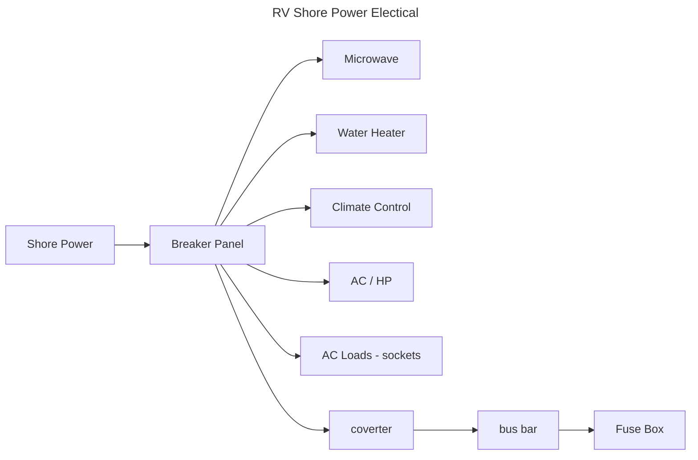
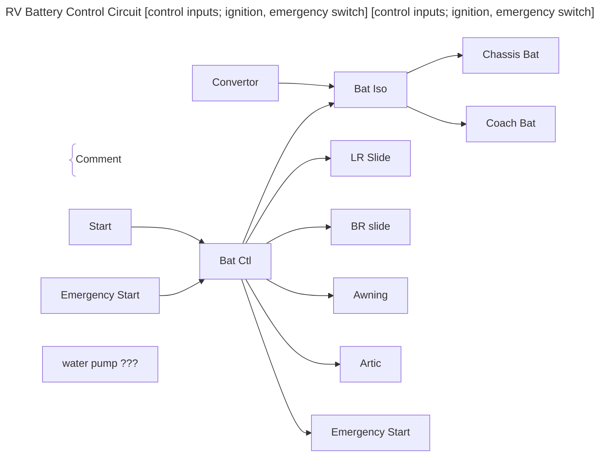
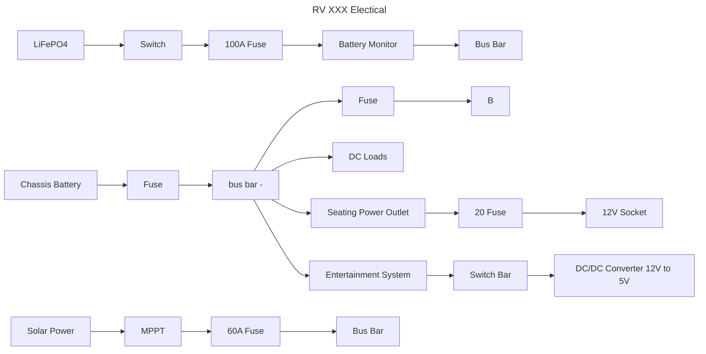
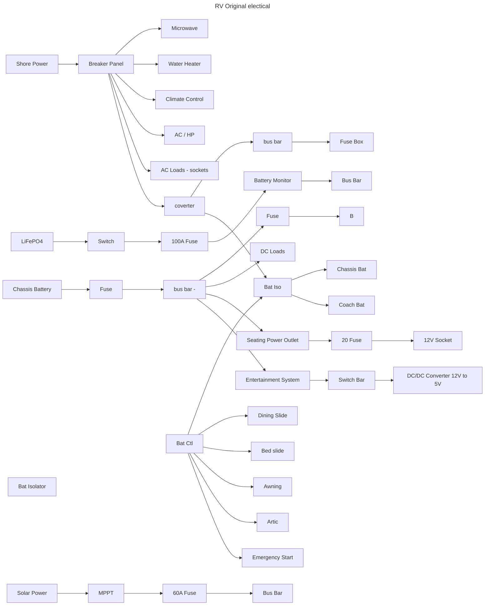

# upgrade Ideas

---
---

---
---



    K[AC Charger] --> L[Convert to DC] --> M[Fuse] --> J
--- :sunrise_over_mountains: 🌄

```
ac -> breaker panel -> microwave
                    -> water heater
                    -> AC / heat pump
                    ->
solar -> convert -> fuse -> bus bar
ac -> convert -> fuse -> bus bar
chassis battery -> fuse -> bus bar

LiFePO4 battery -> fuse -> shunt -> bus bar

bus bar -> fuse -> breaker panel -> loads

```

### PD4060K - Converter


### BCC - Battery Control Circuit
- Omron G8N-1: SPDP 14V 25A; motor control
- Ignition off (??)
    - [X] J1 F1 Emergency Start Switch 5A
    - [ ] J3 F3 Outside TV
    - [ ] J5 F5 Electric Step
    - [ ] J7 F7 Radio Power
    - [X] J9 F9 Artic Pac 15A
    - [ ] J11 F11 Subwoofer
- Ignition on (except for Awning)
    - [ ] J2 F2 Rear Bedroom slide
    - [X] J4 F4 Living Room slide 20A
    - [ ] J6 F6 Kitchen Slide
    - [X] J8 F8 Bedroom Slide 20A
    - [X] J10 F10 Awning 15A

### Monitor
- 1/0AWG black / red wire
- battery monitor
- bus bar

### Battary Isolator
- It prevents loads in one system from discharging both and connects the two systems while charging.
- The coach battery is charged while driving and the chassis battery is charged when plugged into shore power. The BIM monitors the battery voltage of both the chassis and coach batteries over long periods of time.
- If it senses a charging voltage, it connects the two batteries together. Once the batteries have charged for 1 hour, the BIM will isolate the batteries to prevent overcharging, and only reconnect the batteries if one of the batteries drops to 80% charge.
- Isolates batteries to prevent discharging or overcharging, waterproof.
- The BIM monitors the battery voltage of both the chassis and coach batteries over long periods of time.
    - BCC 00-10033-600 (Precision Circuits Inc)
    - BIM160 00-10041-200 (Precision Circuits Inc)
        - [NW RV Supply](https://www.nwrvsupply.com/product/precision-circuits-inc-battery-isolation-manager-160amp-00-10041-200/)
        - Flooded / Flooded battery isolation
    - BIM225 00-10041-260 (Precision Circuits Inc)
        - [PCI LI BIM](https://www.precisioncircuitsinc.com/product/lithium-battery-isolation-manager/)
        -
### Battery Compartment
- 25"w 7"d 8"h: battery
- 25"w 7"d 9"h: box
- 1" lip around


### Intertainment
- 18AWG black/red wire
- panel switch
- dc / dc converter 12v to 5v

### Seating Power
- 20A 12V socket
- 10AWG black/red wire
- 20A fuse

### Connexx connections
- orange coax: RF/TV Antenna
- black coax: atenna
- speakers: blue-black/black, green-black/black
- heavy red/black: 12vdc

### BluRay 12v
- positive = inner
- negative = outer

### USB 5v
- positive = red (pin 1)
- negative = black (pin 4)
